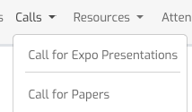

<div align="center">
  <h2 style="font-size: 36px; font-weight: bold; color: #333;">From Scratch to Submission: A Complete Guide to Academic Conference Paper Writing</h2>
  <h4 style="font-size: 20px; color: #777; font-style: italic;">“Research is to see what everybody else has seen and to think what nobody else has thought.” — Albert Szent-Györgyi</h4>
</div>

<div align="center" style="margin-top: 20px;">
  <!-- GitHub Stars Badge -->
  
  <!-- License Badge -->
  
  <!-- Documentation Badge -->
  
</div>

---

# 📜 LaTeX Documentation for Academic Writing

If you're new to LaTeX, I recommend starting with the "111 Minutes to Learn LaTeX" guide for a quick and effective introduction.  
[Read the guide here](https://ctan.math.washington.edu/tex-archive/info/lshort/chinese/lshort-zh-cn.pdf)

For experienced users, this document serves as an invaluable resource for referencing LaTeX commands and symbols, including the symbol table and both ordinary and advanced mathematical symbols. It's a go-to reference for efficient handling of LaTeX syntax and advanced typesetting needs.

By using this guide, you’ll be able to quickly find and apply the symbols you need for your academic papers.

## 📥 1. Downloading Conference Templates

To begin, download the official LaTeX template from the target conference website. Look for the “Call for Papers” section, where you’ll find Author Instructions and Style Files.

<div align="center">  
    
    
</div>

For Overleaf users, upload the template directly to your Overleaf project:
🔗 [Overleaf](https://www.overleaf.com/)

## 📂 2. Organizing Your LaTeX Project

A well-structured LaTeX project enhances readability and simplifies collaboration. Here’s a recommended folder structure:

```
📁 Project Root
 ├── 📁 Figures/        # Stores all figure files (PNG, PDF, EPS)
 ├── 📁 Tables/         # Stores LaTeX tables
 ├── 📁 Sections/       # Stores individual sections as separate .tex files
 │    ├── 0_Teaser.tex
 │    ├── 1_Introduction.tex
 │    ├── 2_Related_Work.tex
 │    ├── 3_Method.tex
 │    ├── 4_Experiment.tex
 │    ├── 5_Conclusion.tex
 │    ├── 6_Appendix.tex
 ├── 📄 references.bib   # Bibliography file for citations
 ├── 📄 main.tex         # Main LaTeX file organizing the paper
 ├── 📄 template.cls     # Conference template class file
 ├── 📄 style.sty        # Additional formatting files (if provided)
 ├── 📄 Additional Files
```

Best Practices:

- ✅ Use \input{} to modularize sections instead of writing everything in main.tex.
- ✅ Keep figures and tables in dedicated folders for better file management.
- ✅ Follow the conference's required file structure (e.g., supplementary materials).

## 📚 3. Citation and Reference Formatting

For conference papers, use @inproceedings, while journal papers should be formatted as @article. Maintain a consistent citation style and use pre-defined conference abbreviations for clarity.

BibTeX Example:

```
@inproceedings{example2024,
  author    = {John Doe and Jane Smith},
  title     = {A Novel Approach to XYZ},
  booktitle = CVPR,
  year      = {2024}
}

@article{example_journal,
  author  = {John Doe and Jane Smith},
  title   = {Deep Learning for XYZ},
  journal = PAMI,
  volume  = {42},
  number  = {4},
  pages   = {123-135},
  year    = {2024}
}
```

When writing academic papers in LaTeX, defining shorthand for commonly referenced conferences and journals can help maintain consistency and reduce redundancy in citations. Below is a set of predefined BibTeX string abbreviations for major conferences and journals:

```
@String(PAMI  = {IEEE TPAMI})
@String(IJCV  = {IJCV})
@String(CVPR  = {CVPR})
@String(ICML  = {ICML})
@String(ICCV  = {ICCV})
@String(ECCV  = {ECCV})
@String(NIPS  = {NeurIPS})
@String(ICPR  = {ICPR})
@String(ICML  = {ICML})
@String(BMVC  =	{BMVC})
@String(TOG   = {ACM TOG})
@String(TIP   = {IEEE TIP})
@String(TVCG  = {IEEE TVCG})
@String(TCSVT = {IEEE TCSVT})
@String(TMM   =	{IEEE TMM})
@String(ACMMM = {ACM MM})
@String(ICME  =	{ICME})
@String(ICASSP=	{ICASSP})
@String(ICIP  = {ICIP})
@String(ACCV  = {ACCV})
@String(ICLR  = {ICLR})
@String(IJCAI = {IJCAI})
@String(PR = {PR})
@String(AAAI = {AAAI})
@String(CVPRW= {CVPRW})
@String(CSVT = {IEEE TCSVT})
```

- 📝 Customizing Your Abbreviations

  > You can modify these shortcuts to match your preferred citation style or add additional conferences and journals as needed. Simply include the @String definitions in your BibTeX file.

- 🔹 Citation Usage Tips

  > Use \cite{} for standard citations.
  > Use \citep{} for parenthetical citations (e.g., ”… has been studied extensively (Smith et al., 2023)”).
  > Use \citet{} for inline citations (e.g., “Smith et al. (2023) proposed…”).

  This method ensures consistency, clarity, and efficiency in managing references across your academic paper. 🚀

## 📊 4. Table Formatting

LaTeX provides flexible table formatting options. Below are examples for basic tables and multi-row/multi-column tables.

Basic Table (Resizable to Page Width)

```
\begin{table*}[t]
  \centering
  \caption{Performance Comparison on Benchmark Datasets}
  \renewcommand{\arraystretch}{1.0} % Adjust line height
  \label{tab:results}
    \resizebox{\textwidth}{!}{
        \begin{tabular}{lcccc}
        \toprule[1.2pt]
        Dataset & Method & Year & Metric$_1$ & Metric$_2$ \\
        \midrule[0.4pt]
        CIFAR-10 & ExampleNet & 2024 & 85.2 & 0.92 \\
        ImageNet & AnotherNet & 2023 & 76.4 & 0.88 \\
        \bottomrule[1.2pt]
        \end{tabular}
  }
\end{table*}
```

Multi-Row & Multi-Column Table

```
\begin{table}[t]
  \centering
  \caption{Dataset Statistics}
  \label{tab:dataset_stats}
  \begin{tabular}{l|c|c}
    \hline
    \multicolumn{1}{c|}{\multirow{2}{*}{Dataset}} & \multicolumn{2}{c}{Statistics} \\
    \cline{2-3}
    & Samples & Classes \\
    \hline
    CIFAR-10 & 60,000 & 10 \\
    ImageNet & 1,280,000 & 1000 \\
    \hline
  \end{tabular}
\end{table}
```

📌 Best Practice: For visually appealing tables, reference high-quality examples from ArXiv preprints.

## 📷 5. Figure Formatting

LaTeX supports single-column and multi-column figures. Ensure your figures are high resolution (.pdf or .eps).

Single Figure

```
\begin{figure*}[t]
  \centering
  \includegraphics[width=\linewidth]{figures/example.pdf}
  \caption{Illustration of the proposed method.}
  \label{fig:method}
\end{figure*}
```

Multiple Figures (Subfigures using tabular environment)

```
\begin{figure}[t]
    \centering
    \begin{tabular}{@{}c@{\hspace{-0.25mm}}c@{}}
        \includegraphics[width=0.495\linewidth]{file 1}&
        \includegraphics[width=0.495\linewidth]{file 2}\\
        \parbox{0.495\linewidth}{\centering \footnotesize{(a) sub caption 1}} &
        \parbox{0.495\linewidth}{\centering \footnotesize{(b) sub caption 2}}
    \end{tabular}
    \caption{}
    \label{}
\end{figure}
```

📌 Best Practice: Avoid low-resolution figures; use vector graphics (.pdf) whenever possible.

## 🔧 6. Predefined Commands for Consistency

To ensure **consistent formatting** in LaTeX documents, we provide predefined commands for commonly used abbreviations and Latin phrases. These commands help standardize writing across papers and improve readability.

### 📌 Usage Instructions

1. **Define the commands** in the LaTeX preamble (`.tex` file), typically in `main.tex` or a dedicated `commands.tex` file.
2. **Use the commands** in the document body instead of manually formatting text, ensuring uniform typography.

### 🖋️ Example Usage

```
\eg~is used to introduce examples, such as \eg apple, banana, and orange.

\etal~is commonly used in citations, e.g., Smith \etal~(2023).
```

### 🛠️ Predefined Commands

```

TODO: Latex pre-define
\def\eg{\emph{e.g}\onedot} \def\Eg{\emph{E.g}\onedot}
\def\ie{\emph{i.e}\onedot} \def\Ie{\emph{I.e}\onedot}
\def\cf{\emph{cf}\onedot} \def\Cf{\emph{Cf}\onedot}
\def\etc{\emph{etc}\onedot} \def\vs{\emph{vs}\onedot}
\def\wrt{w.r.t\onedot} \def\dof{d.o.f\onedot}
\def\iid{i.i.d\onedot} \def\wolog{w.l.o.g\onedot}
\def\etal{\emph{et al}\onedot}

\newcommand{\eg}{\emph{e.g.}}
\newcommand{\Eg}{\emph{E.g.}}
\newcommand{\ie}{\emph{i.e.}}
\newcommand{\Ie}{\emph{I.e.}}
\newcommand{\cf}{\emph{cf.}}
\newcommand{\Cf}{\emph{Cf.}}
\newcommand{\etc}{\emph{etc.}}
\newcommand{\vs}{\emph{vs.}}
\newcommand{\wrt}{w.r.t.}
\newcommand{\dof}{d.o.f.}
\newcommand{\iid}{i.i.d.}
\newcommand{\wolog}{w.l.o.g.}
\newcommand{\etal}{\emph{et al.}}

```

💡 Tip: The \def method is more compact but should be used with care in large projects, while \newcommand is safer and recommended for modular LaTeX documents.

## 📝 7. Mathematical Equations in LaTeX

Proper formatting of equations in LaTeX ensures **clarity, consistency, and professional presentation** in academic writing. Below are standardized guidelines for using mathematical expressions in papers.

### ✏️ Inline Equations

For equations that appear **within a sentence**, use **`$...$`**:

```latex
The loss function is defined as $L = ||f(x) - y||^2$, where $f(x)$ is the model output.
```

### 📐 Display Equations

- 🔹 (a) Single-Equation Block
  For equations occupying a full line, use the equation environment. Each equation must end with appropriate punctuation (comma or period based on sentence structure).

  ```
  \begin{equation}
    L = \sum_{i=1}^{n} ||f(x_i) - y_i||^2.
    \label{eq:loss_function}
  \end{equation}
  ```

- 🔹 (b) Multi-Line Equations with a Single Number
  For multi-line equations sharing one equation number, use gather:

  ```
  \begin{gather}
    L = \sum_{i=1}^{n} ||f(x_i) - y_i||^2, \\
    \text{where } f(x_i) = W x_i + b.
      \label{eq:multi_loss}
  \end{gather}
  ```

- 🔹 (c) Multi-Line Equations with Individual Numbers
  Use align for multiple equations where each line has a separate equation number. The & symbol specifies alignment positions.
  ```
  \begin{equation}
    \begin{aligned}
        L &= \sum_{i=1}^{n} ||f(x_i) - y_i||^2, \\
        f(x_i) &= W x_i + b.
    \end{aligned}
    \label{eq:align_loss}
  \end{equation}
  ```

### 🛠️ Essential Math Formatting

- ✅ Proper Use of Brackets and Delimiters
  Always use \left and \right to automatically adjust sizes of brackets, braces, or vertical bars.
  ```
  \begin{equation}
    L = \left( \sum_{i=1}^{n} \left| f(x_i) - y_i \right|^p \right)^{\frac{1}{p}}.
    \label{eq:norm}
  \end{equation}
  ```
- ✅ Required Packages
  Ensure the following packages are included in the LaTeX preamble:
  ```
  \usepackage{amsmath}   % Enhanced math typesetting
  \usepackage{amssymb}   % Additional math symbols
  \usepackage{bm}        % Bold math symbols
  ```
- ✅ Using Math Blackboard (\mathbb{}) and Calligraphic (\mathcal{}) Letters
  - Blackboard Bold (\mathbb{}) is commonly used for number sets:
    > \mathbb{R}, \mathbb{N}, \mathbb{Z}, \mathbb{Q}, \mathbb{C}
  - Calligraphic (\mathcal{}) is often used for functions or sets:
    > \mathcal{L}, \mathcal{D}, \mathcal{F}
- ✅ Using \text{} in Equations
  Use \text{} inside equations to include normal text:
  ```
  \begin{equation}
    L = \sum_{i=1}^{n} ||f(x_i) - y_i||^2, \quad \text{where } f(x_i) = W x_i + b.
    \label{eq:text_example}
  \end{equation}
  ```
  💡 Tip: Avoid using \mathrm{} for standard text inside equations. Use \text{} instead for proper spacing and formatting.

## 🔖 8. Citation Formatting in LaTeX

### 🔹 Non-Breaking Spaces (`~`)

Always use `~` for non-breaking spaces to **prevent unintended line breaks** in references

> ~\cite{author2024}

### 📑 Citing Research Papers

- Standard Paper Citation
  Most LaTeX templates use cite, citep, or citet. The exact command may vary depending on the bibliography package (natbib, biblatex, etc.).

  > Multiple studies~\cite{author2024, researcher2023} have explored this phenomenon.

- For author-based citations (when using natbib):

  > \citet{author2024} proposed an innovative approach.

- For inline citations:
  > According to~\citep{author2024}, this method is effective.

NOTE: Different templates may use different citation commands. Check the template’s documentation for compatibility.

### 🏷️ Referencing Equations, Figures, and Sections

Use **\Cref{}** (from the cleveref package) to automatically adjust label.

---

# 📚 AI Tools for Academic Writing

## 🛠️ 1. Recommended AI Tools

1. **GPT Academic** - [GitHub Repository](https://github.com/binary-husky/gpt_academic)
2. **NextChat (ChatGPT Next Web)** - [GitHub Repository](https://github.com/ChatGPTNextWeb/NextChat)

## 🎯 2. Useful Prompts

- **Bilingual Translation**

  > I want you to act as a scientific English-Chinese translator. I will provide you with a paragraph in one language, and your task is to accurately and academically translate it into the other language. Do not repeat the original text. Use natural language processing and effective writing techniques to enhance readability. Identify the original language first, then provide the translation.

- **Academic Writing Enhancement**

  > Below is a paragraph from an academic paper. Please refine it to align with formal academic style, improving spelling, grammar, clarity, conciseness, and readability. Rewrite entire sentences if necessary. First, provide the polished paragraph. Then, list all modifications in a markdown table, explaining the rationale behind each change.

- **Paper Polishing for Submission**

  > I am preparing my _[conference/journal name]_ paper for submission and require assistance in refining each paragraph for academic rigor. Please correct grammatical errors, enhance sentence structure for scholarly suitability, and formalize the tone where needed. Provide a markdown table with three columns: (1) Original sentence, (2) Highlighted revision, and (3) Explanation for the change. Finally, rewrite the fully revised paragraph. If you understand, please reply: "Yes, let's get started."

- **Persuasive Academic Writing Feedback**

  > Please review my writing style and provide feedback on how to make it more persuasive and compelling for academic submission. Include a revised version of my paragraph with enhanced readability and coherence.

- **Clarity & Readability Improvement**

  > As a non-native English speaker, I need help improving the clarity of my writing. Please check for grammar, spelling, and structural issues while suggesting clearer alternatives. Provide the fully revised paragraph.

---

# 🎨 Framework Design

## 🖥️ 1. Recommended Software

- **Microsoft PowerPoint (PPT)** – Widely used for creating high-quality visual frameworks, including oral presentation figures.
- **Visio** – Ideal for complex diagramming and flowchart creation.

## 📝 2. Font & Style Guidelines

- **Font Style**: Arial, Helvetica, Sans Serif
- **Consistent color themes** to maintain readability and professional aesthetics.

## 🎨 3. Design Resources

- **Vector Graphics Library**: [IconFont](https://www.iconfont.cn/)
- **Color Palette Generator**: [ColorKit](https://colorkit.co/)

---

# 🔒 Anonymous Code Submission

## 📂 1. Submission Guidelines

> All code submissions must be made through an anonymous repository to ensure privacy and neutrality.
> Contributors should ensure no personal or identifiable information is included in the code or documentation.

## 🚀 2. Repository for Submissions

Please use the following repository for anonymous code contributions:
🔗 **Anonymous Repository:** [anonymous.4open.science](https://anonymous.4open.science/)

---

# 🌐 Open-Source Project and Research Page

## 🏗️ 1. Creating a Project Page

To enhance visibility and accessibility, a **project page** can be created using GitHub Pages.
Follow these steps:

1. Use the **[Academic Project Page Template](https://github.com/eliahuhorwitz/Academic-project-page-template)** as a starting point.
2. Modify the HTML and Markdown files to fit your project details.
3. Deploy the page on **GitHub Pages** (`yourusername.github.io/repository-name`).
4. Ensure the page contains a clear **project summary, visualizations, and relevant links**.

## 📖 2. Publishing on GitHub

- **Avoid references to specific conferences or journals** to comply with double-blind review policies.
- **Include a clear README** with structured documentation (e.g., installation, usage, and dataset information).
- **Use an appropriate open-source license** (e.g., MIT, Apache 2.0).
- **Keep commit history anonymous** by removing identifiable metadata from commits.

## 📜 3. Preprint on arXiv

For broader accessibility, consider submitting your research as a **preprint on arXiv**:

🔗 **arXiv Submission Portal:** [arXiv.org](https://arxiv.org/)

By following these steps, you ensure compliance with anonymity requirements while maximizing the impact of your research. 🚀

Note: `-` instead of `-`.

---
